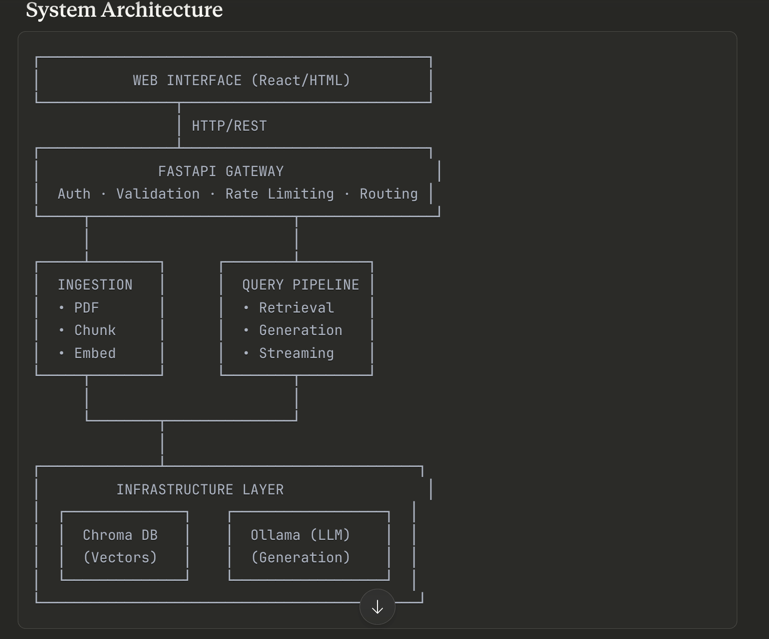

# IntroductoryRag


## Flow


## To run locally
1. Install docker desktop and docker-compose
2. clone the repository
3. move to the root directory pdf_trainer
4. run `docker-compose up --build`This will spin up three containers
   1. chroma - vector database
   2. ollama-phi3 - as the model
   3. fast-api - the application
5. If all is successful then you should be able to visit the below url http://localhost:80/docs you should be able to see the swager ui

## How to use?
1. This should open swagger uri http://localhost:80/docs in which you will find the endpoints.
2. You have two endpoints.
   1. Post method to submit your pdf that you would like the AI to get trained upon. 
   2. eg ```curl -X 'POST' \
  'http://0.0.0.0/uploadfile/' \
  -H 'accept: application/json' \
  -H 'Content-Type: multipart/form-data' \
  -F 'file=@test.pdf;type=application/pdf'```
   2. Get method - you can use this method to test the status of processing of the uploaded pdf eg: If the uploaded file name is test.pdf 
   3. then ```curl -X 'GET' \
  'http://0.0.0.0/files/test.pdf/status' \
  -H 'accept: application/json'```
   4. This will return ```{
  "file": "test.pdf",
  "status": "done"
}```
3. Now you can run the following command to use a cli chat assistant. ```python src/db/query_example.py <filename>.pdf```

4. for windows machine make sure you turn LF in bottom of the vscode
